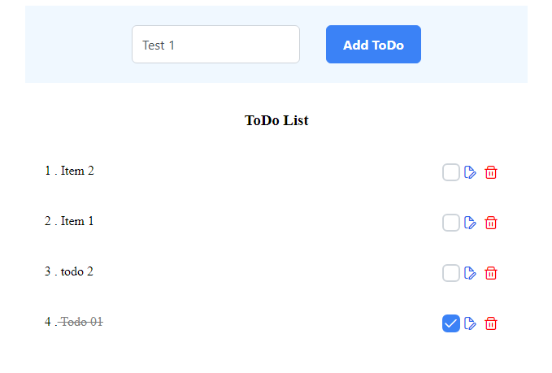

# Todo App

Todo list CRUD app using `Angular 14` and `NgRx 14`.
This app combines Angular for UI and NgRx for state management. Angular brings structure and efficiency, while NgRx handles state in a scalable way.

Actions, reducers, and the store in NgRx drive this Todo list's state.

`Actions` trigger changes, `Reducers` manage transitions, and `store` maintains a single source of truth.

## clone the project and run

```bash
npm install // <-- install dependencies -->
npm start // <-- run the project -->
```

## app view



## references

[PrimeNg user guide](https://www.primefaces.org/primeng-v14-lts/)

[NgRx user guide](https://ngrx.io/)
